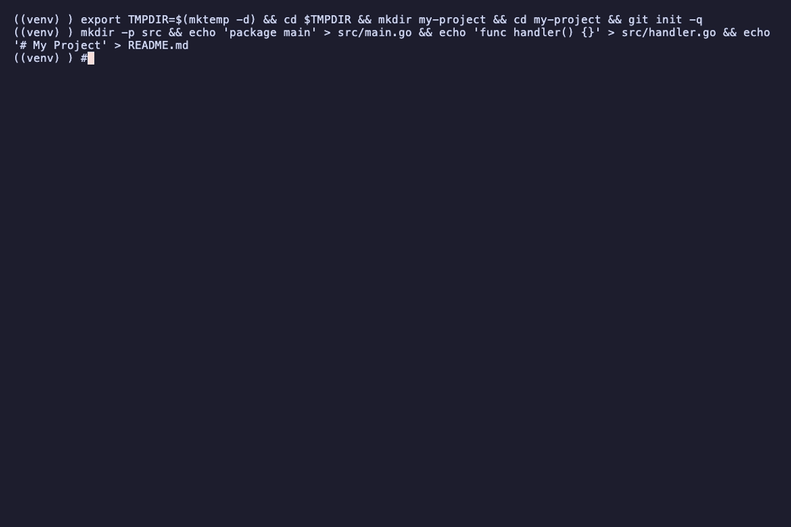

# Belay

AI-aware local version control for concurrent agent workflows.

<p align="center">
  
</p>

## What It Does

Belay is an event-sourced filesystem journal that captures every file change with AI session attribution. It is built for multi-agent development environments where multiple AI tools edit files simultaneously and traditional VCS cannot track who changed what, or when. Belay uses a content-addressable object store with gzip compression, so every version of every file is recoverable. An append-only event log with a SQLite index makes querying fast across thousands of events.

## Key Features

- **Session attribution** -- automatically detects which AI session (Claude Code, etc.) made each change
- **File recovery** -- restore any file to any prior version by time, event ID, or session
- **Session replay and diff** -- reconstruct exactly what a session did, as unified diffs or applied patches
- **Conflict detection** -- find overlapping modifications across concurrent sessions
- **CLI + REST API** -- full control from the terminal or programmatically
- **SSE streaming** -- real-time event stream for building integrations
- **Hook-based capture** -- push events from AI tools with exact attribution (no polling)
- **Content-addressable store** -- SHA-256 hashed, gzip-compressed, deduplicated

## Installation

### Homebrew (macOS / Linux)

```bash
brew install davidparkercodes/tap/belay
```

### Go Install

```bash
go install github.com/davidparkercodes/belay/cmd/belay@latest
```

### From Source

```bash
git clone https://github.com/davidparkercodes/belay.git
cd belay
go build -o bin/belay ./cmd/belay
```

### Pre-built Binaries

Download from the [Releases page](https://github.com/davidparkercodes/belay/releases).

## Quick Start

```bash
belay init                      # Initialize .belay/ in your project
belay daemon start              # Start watcher + API server
```

## Prerequisites

- **Go 1.24+**

## Platform Support

- **macOS** — uses FSEvents for efficient recursive file watching
- **Linux** — uses inotify via fsnotify. Large repos may need `fs.inotify.max_user_watches` increased (default is often 8192; Belay watches up to 2048 directories)
- **Windows** — uses ReadDirectoryChangesW via fsnotify

## Architecture

- **Backend**: Go -- CLI (Cobra), filesystem watcher (FSEvents on macOS, fsnotify elsewhere), embedded HTTP API server, SQLite index
- **Storage**: Append-only event log (binary segments) + content-addressable object store (SHA-256, gzip) + SQLite WAL-mode index
- **Config**: `.belay/config.toml`

## CLI Commands

| Command | Description |
|---------|-------------|
| `belay init` | Initialize `.belay/` in the current directory |
| `belay daemon start` | Start the watcher daemon (includes API server on :33412) |
| `belay daemon stop` | Stop the daemon |
| `belay daemon status` | Show daemon status |
| `belay status` | System and session overview |
| `belay log` | Browse event history with filters |
| `belay diff` | View changes between time points or sessions |
| `belay restore` | Recover files from history (by time, event, or session) |
| `belay sessions` | List, inspect, and label AI sessions |
| `belay replay` | Replay a session's changes (patch, stat, or apply) |
| `belay snapshot` | Reconstruct project state at any point in time |
| `belay commit` | Generate a git commit from a session with Belay trailers |
| `belay conflicts` | Detect overlapping modifications across sessions |
| `belay record` | Push a file-write event (used by hooks) |
| `belay gc` | Garbage collection and storage compaction |
| `belay rebuild-index` | Rebuild SQLite index from event log (recovery) |

## API Endpoints

All endpoints are served on `:33412` when the daemon is running.

| Method | Path | Description |
|--------|------|-------------|
| GET | `/api/health` | Health check |
| GET | `/api/stats` | Aggregate statistics |
| GET | `/api/events` | Query events (since, until, file, session, limit) |
| GET | `/api/events/:id` | Get single event |
| GET | `/api/sessions` | List sessions (active filter) |
| GET | `/api/sessions/:id` | Session details |
| GET | `/api/sessions/:id/events` | Events for a session |
| GET | `/api/sessions/:id/replay` | Replay session changes |
| GET | `/api/files` | List modified files |
| GET | `/api/files/history` | File change history |
| GET | `/api/files/content` | Get file content by hash |
| GET | `/api/conflicts` | Detect conflicts (since, file filters) |
| POST | `/api/record` | Push file event from hook |
| GET | `/api/stream` | SSE real-time event stream |

## Configuration

Belay stores its data in a `.belay/` directory at the project root. Configuration lives in `.belay/config.toml`:

```toml
[daemon]
log_level = "info"           # debug, info, warn, error

[watcher]
debounce_ms = 50             # lower = more granular history, higher = less noise
max_file_size_mb = 50        # files larger than this skip content capture (0 = no limit)

[storage]
compression_enabled = true   # gzip compression for stored objects

[retention]
hot_hours = 24               # full-fidelity (every event kept)
warm_days = 7                # deduplicated (rapid edits collapsed)
cold_days = 30               # summarized (session boundaries only)
archive_days = 365           # minimal (daily snapshots, 0 = forever)
max_storage_gb = 10          # triggers aggressive compaction when exceeded

[api]
port = 33412
host = "127.0.0.1"              # bind address (default: localhost only)

[safety]
allow_writes = false         # when false, destructive commands are dry-run only
```

All settings have sensible defaults. The config file is optional — `belay init` generates one with defaults.

Ports are configurable. If 33412 is occupied, set `[api] port` to any available port.

Retention compaction is applied automatically when running `belay gc`. Each tier uses a different strategy:

- **Hot** (default: 24h) — Full fidelity, every event kept
- **Warm** (default: 7 days) — Rapid consecutive edits collapsed (modifies within 60s merged)
- **Cold** (default: 30 days) — Session boundaries only (first + last event per file per session)
- **Archive** (default: 365 days) — Daily snapshots (one event per file per day)
- **Purge** — Events older than `archive_days` are deleted entirely (set to `0` to retain forever)

If `max_storage_gb` is exceeded, aggressive compaction is applied to the hot tier. Use `belay gc --dry-run` to preview what would be cleaned up. Use `belay gc --gc-only` to skip compaction and only remove orphaned objects.

`safety.allow_writes` defaults to false. Commands that modify your filesystem (restore, replay --output, snapshot --output, commit) will show what they *would* do without actually writing anything. Set to `true` once you trust the setup.

Ignore patterns work like `.gitignore` and are read from `.belay/config.toml` or a `.belayignore` file.

## AI Tool Integration

Belay supports push-based event capture through hooks. When an AI tool writes a file, the hook notifies Belay with the file path, operation, and session ID, giving exact attribution.

### Claude Code Setup

Add the hook to your Claude Code settings (`~/.claude/settings.json`):

```json
{
  "hooks": {
    "PostToolUse": [
      {
        "matcher": "Write|Edit|NotebookEdit",
        "hooks": [
          {
            "type": "command",
            "command": "/path/to/belay/hooks/belay-hook.sh"
          }
        ]
      }
    ]
  }
}
```

The hook script reads the tool use JSON from stdin, extracts the file path and session ID, and calls `belay record` in the background. It is non-blocking and will not slow down your AI tool.

### Other Tools

Any tool can push events via the REST API:

```bash
curl -X POST http://localhost:33412/api/record \
  -H "Content-Type: application/json" \
  -d '{"file_path": "src/main.go", "operation": "modify", "tool_name": "my-tool", "session_id": "abc123"}'
```

Without hooks, Belay still captures all file changes via filesystem watching and uses process-tree heuristics for session attribution.

## Building

```bash
go build -o bin/belay ./cmd/belay
```

To install globally:

```bash
go install ./cmd/belay
```

### Running Tests

```bash
go test ./...
go vet ./...
```

## License

MIT. See [LICENSE](LICENSE).
