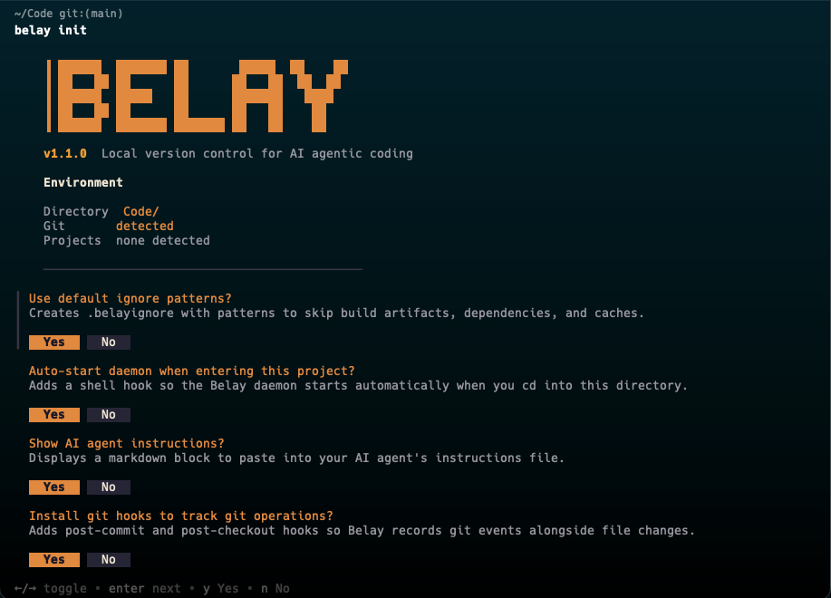

# Belay

[](https://go.dev/)
[](LICENSE)
[](https://github.com/davidparkercodes/belay/releases)
[](https://github.com/davidparkercodes/belay/releases)
[](https://github.com/davidparkercodes/belay/releases)
[](https://github.com/davidparkercodes/belay/releases)

**Never lose code to an AI session again.**

Belay tracks every file change between git commits, attributes each change to the AI session that made it, and gives you a complete, recoverable history. Install it once, forget about it. When something goes wrong, recover any file in under a second.

Free, local, and open source.

## Why Belay?

AI agents move fast. A working codebase can break in a few prompts, and if you didn't commit, that version is gone. Run multiple agents in parallel and they silently overwrite each other's work. Git can't help -- it doesn't know about AI sessions.

Belay watches your filesystem, records every change, and tags each one to the AI session that made it. When two agents edit the same file, Belay catches it. When an agent destroys your work, Belay recovers it. Your AI agents can also use Belay directly to check what changed, detect conflicts, and restore files.

## Install

**Homebrew (macOS)**
```bash
brew install davidparkercodes/tap/belay
```

**Go Install (any platform with Go 1.24+)**
```bash
go install github.com/davidparkercodes/belay/cmd/belay@latest
```

**Pre-built Binaries** -- Download from the [Releases page](https://github.com/davidparkercodes/belay/releases).

**Build from Source**
```bash
git clone https://github.com/davidparkercodes/belay.git
cd belay && go build -o bin/belay ./cmd/belay
```

Belay is a single static binary with zero runtime dependencies.

## Quick Start

```bash
belay init
```

<p align="center">
  
</p>

That's it. Belay is now capturing every file change. Go back to work.

## Features

- **Continuous Capture** -- Runs silently in the background. Every file change is saved the instant it happens. No commits, no staging, no action needed.
- **Session Attribution** -- Every change is tagged to the session that made it. Claude Code, Cursor, Copilot, or your own saves. Belay tracks who changed what, when, and in what order.
- **Instant Recovery** -- One command to restore any file to any previous state. Browse history by time or by session and get back what you lost.
- **Conflict Detection** -- Alerts when multiple sessions edit the same file. Untangle overlapping work between agents with a full attribution trail.
- **Zero Intrusion** -- Never modifies your tools or slows them down. Watches the filesystem quietly, but when something goes wrong, your AI agent can use Belay directly.
- **Fully Local** -- All data stays on your machine. No cloud accounts, no sign-ups. A single init command creates your config and starts watching.

## How It Works

Belay uses kernel-level filesystem notifications (FSEvents on macOS, fsnotify on Linux/Windows) to watch your project. Every file write is hashed (SHA-256) and stored in a content-addressable object store with gzip compression. An append-only event log and SQLite index make queries fast across thousands of events.

Session attribution works automatically via process-tree heuristics, or with exact precision through hook-based integration with AI tools like Claude Code.

## AI Tool Integration

### Claude Code

Belay attributes changes to sessions automatically via process-tree heuristics, but adding the hook gives exact attribution. It fires after every file write, telling Belay precisely which session made the change.

Add the hook to your Claude Code settings (`~/.claude/settings.json`):

```json
{
  "hooks": {
    "PostToolUse": [
      {
        "matcher": "Write|Edit|NotebookEdit",
        "hooks": [
          {
            "type": "command",
            "command": "/path/to/belay/hooks/belay-hook.sh"
          }
        ]
      }
    ]
  }
}
```

The hook reads tool use JSON from stdin, extracts the file path and session ID, and calls `belay record` in the background. Non-blocking, will not slow down your AI tool. Without hooks, Belay still captures all changes via filesystem watching and uses process-tree heuristics to attribute sessions.

### Any Tool

For AI tools that don't support hooks, or custom integrations, push change events directly via the REST API:

```bash
curl -X POST http://localhost:33412/api/record \
  -H "Content-Type: application/json" \
  -d '{"file_path": "src/main.go", "operation": "modify", "tool_name": "my-tool", "session_id": "abc123"}'
```

## CLI Reference

| Command | Description |
|---------|-------------|
| `belay init` | Initialize `.belay/` in the current directory |
| `belay daemon start` | Start the background watcher daemon |
| `belay daemon stop` | Stop the daemon |
| `belay status` | System and session overview |
| `belay log` | Browse event history with filters |
| `belay diff` | View changes between time points or sessions |
| `belay restore` | Recover files by time, event, or session |
| `belay sessions` | List and inspect AI sessions |
| `belay replay` | Replay a session's changes as diffs or patches |
| `belay conflicts` | Detect overlapping modifications across sessions |
| `belay commit` | Generate a git commit from a session |
| `belay snapshot` | Reconstruct project state at any point in time |
| `belay gc` | Garbage collection and storage compaction |

## API Endpoints

All endpoints served on `:33412` when the daemon is running.

| Method | Path | Description |
|--------|------|-------------|
| GET | `/api/health` | Health check |
| GET | `/api/stats` | Aggregate statistics |
| GET | `/api/events` | Query events (since, until, file, session, limit) |
| GET | `/api/sessions` | List sessions |
| GET | `/api/sessions/:id` | Session details and events |
| GET | `/api/files/history` | File change history |
| GET | `/api/files/content` | Get file content by hash |
| GET | `/api/conflicts` | Detect conflicts |
| POST | `/api/record` | Push file event from hook |
| GET | `/api/stream` | SSE real-time event stream |

## Configuration

Belay stores data in `.belay/` at the project root. Configuration is optional via `.belay/config.toml`:

```toml
[daemon]
log_level = "info"

[watcher]
debounce_ms = 50
max_file_size_mb = 50

[storage]
compression_enabled = true

[retention]
hot_hours = 24        # full fidelity
warm_days = 7         # rapid edits collapsed
cold_days = 30        # session boundaries only
archive_days = 365    # daily snapshots (0 = forever)
max_storage_gb = 10

[api]
port = 33412
host = "127.0.0.1"

[safety]
allow_writes = false  # dry-run mode until you're ready
```

All settings have sensible defaults. `belay init` generates a config with defaults. `safety.allow_writes` defaults to false so destructive commands (restore, replay, commit) show what they'd do without writing. Set to `true` once you trust the setup.

## Platform Support

- **macOS** -- FSEvents for efficient recursive file watching
- **Linux** -- inotify via fsnotify (large repos may need `fs.inotify.max_user_watches` increased)
- **Windows** -- ReadDirectoryChangesW via fsnotify

## Editor Integration

A VS Code extension is included in the `vscode-extension/` directory. It adds a Belay sidebar with recent changes and session views, plus commands for file history and restore.

## License

MIT. See [LICENSE](LICENSE).
